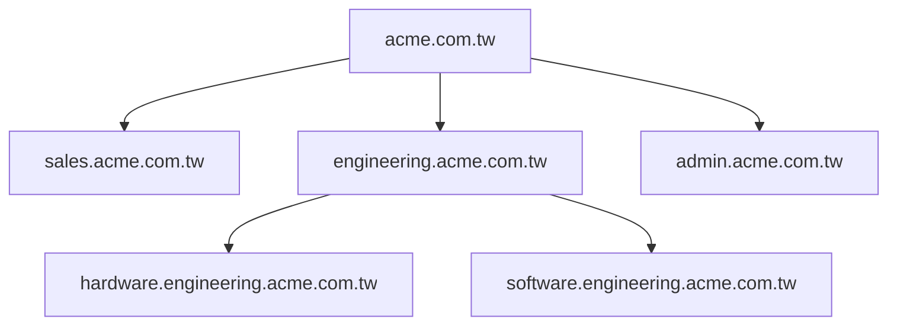

<p style="text-align: center;">
	<b>Glossary</b>
</p>
<p style="text-align: center;">
	<a href="https://activedirectorypro.com/glossary/#basics">
		 https://activedirectorypro.com/glossary/#basics
	</a>
</p>

---
https://www.windows-active-directory.com/active-directory-ad-fundamentals.html
https://sekurak.pl/poznaj-bezpieczenstwo-windows-lokalne-uwierzytelnianie-i-autoryzacja-notatki-ze-szkolenia/


<p style="text-align: center; font-size:300%; background-color:black; "><u>THEORY</u></p>

# Windows Server
**Versions:** 
- Standard - basic version with limited Virtualisation
- Datacenter - full version without virtualisation limits
- Essentials - for small companies with max 25 users and 5 devices
# Active Directory Domain Service

Database of objects, users, groups, computers...
databse have objects: user object, group object and device object
Objects hawe attributes, eg. Users first name, second name, title
the complete set of object types is called schema

![[Pasted image 20240517121233.png]]

When delete object from AD it not goes to `Recycle Bin` (it is not enabled by default), to enable `Recycle Bin` go to
`Server Manager` > `Tools` > `Active Directory Administrative Center` > Click on local domain>` Enable Recycle Bin` or use PowerShell Or [Activate Recycle Bin](https://activedirectorypro.com/enable-active-directory-recycle-bin-server-2016/). Once you enable the Active Directory Recycle Bin you can’t turn it off.

## Physical Perspective

how do we back up database, how do we replicate database to another server
intrasite replication, intersite replication

### Domain Controller

Every domain is associated with Domain Controller, under domain controller you have AD database - `C:/Windows/NTDS` (NT Directory Services).
`C:/Windows/NTDS/ntds.dit` - Actual database file.
Database key components:
- Configuration - Contain info about how forest is configured. Replicate forest wide. Every controller have this copy
- Schema - stores metadata informations about objects, what kind of structure particular object have, store object types and atributes for entire forest.
- Domain - store domain objects. Unique for every domain. Kind of front end services, kerberos, LDAP, exposes schema and DB to end user
- Application particle - custom partition, you create and choose which DC replicate this partition.

**Global Catalog** - The global catalog server contains a full replica of all objects and is used to perform forest wide searches. By default the first domain controller in a domain is designated as the GC server, it is recommended to have at least one GC server for each site to improve performance.https://activedirectorypro.com/glossary/#basics


Other files are log files and check files.
In essence most operations are in memory and when log file reaches certain size they are written to database file.
You can have multiple dommain controllers in network

### Multiple sites

when new site is created / there are multiple sites
`Sites` > `Inter Site Transport` > **control replication between DC** > chose IP/SMTP (SMTP when link is very slow, can be scheduled)

in `Server Manager` tool
`Tools` > `Active Directory Domains and Trusts` to **deals with multiple domains, subdomains and forests** (multiple domains, every AD domain is part of tree and forest, no way possible to not be part of tree or forrest)

in `Server Manager` tool

- `Tools` > `Active Directory Sites and Services` > `Sites` > `Default-First-Site-Name` > `NTDS Site Settings` (info about site) and `Servers` folder (contains all DC in site, replicate copies of AD database)
- `Servers` > `NTDS Settings` **(actual settings of chosen Controller)**
- `NTDS Settings` > `General` tab > `DNS Alias` - GUID - Globally Uniq ID- long HEX number
- `NTDS Settings` > `Connection` tab (replication settings)

## Logical Perspective

Company `acme.com.tw`, child domains - for very large corps



**ADDS (Active Directory Domain Services)** -Windows Server with installed ADDS role. Database of: user accounts, computers, printers, file shares, security groups, respective permissions

**Forest** is combinations of trees, allows for acquiring new domains, forest have global catalog that contains informations about all domains, stores copies of AD objects in the forest. You go to multiple trees when there is name space change. Technicaly when trees are part of same forest they share same schema. You can establish forest trust betwen two existing forests and they can share resources but not share schema.
**Root of the forest** - very first domain in forest. This is where enterprise admins are and have control over entire forest.
**Tree** is combinations of domains that share same namespace, (have same root domain). Domains are part of the same tree when they share parent name. 
**domain** is collection of objects,
**Domain Name** - The DNS name of the domain where the user account resides.
**Domain User Account** - One user account in whole network -
**Trust** enables objects of one domain to access resources in another domain
**OUs** organizational unit is entity to organize, it is not a group
OU vs **Containers** [link](https://www.reddit.com/r/activedirectory/comments/h0fk0j/containers_vs_organizational_units_is_there_ever/)
**Object** is most basic entity of AD
**User Principal Name (UPN)** - a unique identifier assigned to each user in an Active Directory (AD) environment. It is used to log in to the domain and typically follows the format `username@domain.com`. The UPN consists of two parts:
**Username** - The user's account name within the domain.
**RSAT** - Remote Server Administration Tools
**Enterprise admin** - 
It is easier to assign permissions to resources to groups rather than to each user

|                   Workgroup                   |                          Domain                          |
| :-------------------------------------------: | :------------------------------------------------------: |
|            - No server is required            | - A server, called Domain Controller in Active Directory |
| - User accounts are required on every machine |             - User accounts are stored in AD             |

# Server Manager tool
**Install features**
`Manage` > `Add roles and features`

Management:
- `Tools` > `Active Directory Users and Computers` **manage logic aspect of AD** ( general design how it looks) > contains domain and folders called Organizational Units, Groups > each OU contain Users or Hosts
- `Tools` > `Active Directory Users and Computers`> `File` > `Options` - **Delete any changes** made **to AD** Users and computers View
- `Tools` > `Active Directory Users and Computers` > `View` > `Advanced Features` -show or hide certain column
- `Tools` > `Active Directory Users and Computers` > `Saved Queries` - **saved queries to AD**, eg find all users not logged in in 30 days, etc. useful with redundant tasks
- `Tools` > `Active Directory Users and Computers` > Right mouse button on `<Domain_name>` > **Delegate Control** - there is set of users and groups that have control over domain, this groups can be extended
- `Tools` > `Active Directory Users and Computers` > Right mouse button on `<Domain_name>` > `Change Domain` - if you have **subdomain or trusted domains**
- `Tools` > `Active Directory Users and Computers` > Right mouse button on `<Domain_name>` > `Change Domain Controller`
- `Tools` > `Active Directory Users and Computers` > Right mouse button on `<Domain_name>` > `Raise domain functional level` - use when **different versions of Windows Server** are used in one network (eg. Windows server 2012 and Windows Server 2016), functional level of domain will be of oldest version of Domain Controller (2012 in previous eg.) and network cant use newer features (of Windows Server 2016)


**Users settings**, (some things to know):
- `Remote Control` tab > `Enable Remote Control` - allow for **remote controll** or **remote desktop**
- `Account` tab > `logon hours` - change logon hours for eg if you make backup at 01:00AM
- `Account` > `Log On To` - list hosts user can login to
- `Account` > `Account Expires` - make **account expire** after date, usefull for contractors to automaticaly expire their account


Folders vs Folders
Folders without "dot" - not folders, containers, comes automaticaly with AD, cant apply Group Poliscies to them


# Join computer to domain
Remember to change dns IP to DC ip
`My computer` > `Properties` > `Change Settings` > `System Properties` > `Computer Name` tab > `Change` - change data

# Azure Active Directory

Identity as a Service (IaaS) - No domain controller locally, databas is stored in Azure, no OUs as such, is bit like file explorer


Security groups consist of: User accounts, computers, file shares, other groups, 

Purpose of AD:
- Security Authentication: provide
- Centralized security management of network


<p style="text-align: center; font-size:300%; background-color:black; "><u>PRACTICE</u></p>

# Promote Windows Server to Domain Controller role
## Install Roles and Features
![[Pasted image 20240522090820.png]]
![[Pasted image 20240522091353.png]]
![[Pasted image 20240522091541.png]]
## Configure DHCP
![[Pasted image 20240522092457.png]]
## Promote server to DC role in new forest
![[Pasted image 20240522093155.png]]
![[Pasted image 20240522094256.png]]
**Forrest/Domain Function level** required to set when different controller versions work in one domain.
**Directory Service Restory Mode (DSRM)** - #TODO
**Read Only DC (RODC)** - used when physical site is not trusted, replicate database but do not allow for changes made from this DC.

![[Pasted image 20240522094920.png]]
AD database Paths

![[Pasted image 20240522095946.png]]
After restart domain name is shown before
# Connect Host to Domain
![[Pasted image 20240522124336.png]]
Enter login and password for domain administrator account. In case of error check domain name, admin credentials or DNS IP addres (must point to DC).

![[Pasted image 20240522124603.png]]
![[Pasted image 20240522124638.png]]
# DHCP Server Advanced Configuration
![[Pasted image 20240522100943.png]]
![[Pasted image 20240522101052.png]]
![[Pasted image 20240522101223.png]]
![[Pasted image 20240522101317.png]]
Optional exclusion, useful when some addresses are dedicated for servers
![[Pasted image 20240522101454.png]]
![[Pasted image 20240522102055.png]]
Configure Default Gateway
![[Pasted image 20240522102159.png]]

Authorize DC and Activate DHCP server 
![[Pasted image 20240522102623.png]]
![[Pasted image 20240522102658.png]]

## IP Address Reservation
**Reserve Connected Host**
![[Pasted image 20240522104250.png]]

**Reserve using MAC**

![[Pasted image 20240522104616.png]]
![[Pasted image 20240522104757.png]]

## DHCP Failover
https://learn.microsoft.com/en-us/previous-versions/windows/it-pro/windows-server-2012-r2-and-2012/hh831385(v=ws.11)

0. Create new Domain Controller -DC2
1. Install DHCP server on DC2
2. Add DC2's DHCP server to DC's1 DHCP server
   ![[Pasted image 20240605150104.png]]
3. Configure Failover on DC1
   ![[Pasted image 20240605152533.png]]
   ![[Pasted image 20240605152924.png]]
**Configured DHCP failover**
![[Pasted image 20240606105609.png]]

### Remove DHCP failover relation
![[Pasted image 20240606110041.png]]
![[Pasted image 20240606110055.png]]


# Users and Computers in AD

![[Pasted image 20240522125548.png]]

_Udział Macierzysty/Home folder_ - home folder przechowywany na serwerze
## Create New User
![[Pasted image 20240522130925.png]]
## Create New Group
![[Pasted image 20240522131640.png]]
![[Pasted image 20240522132940.png]]
**Group Scope:**
- _Domain Local_ - Work on the open membership principle allowing admins to include users and groups from the same and other domains while enabling shared access to network resources. However, members of a domain local group can access resources belonging to the same domain only.
- _Global_ - Include users and other global groups from their domain but allows the members to access resources belonging to other trusting domains in the same forest.
- _Universal_ - AD users and groups, both global and universal, from different domains in the forest can join the universal group as members. The users of this group can access the network resources belonging to any other domain in the forest. Avoid creating such groups while working with a single domain.

**Group type:**
- _Security_ -  permissions to access network resources to a group of users.
- _Distribution_ - create a pool of users to send common messages or emails through Microsoft Exchange and similar apps. All the mail-enabled members of such a group can receive a broadcast message from the admins.
### Groups in AD
#TODO full translate
_Administrators_
_Users_ - cant manage users and groups, cant create shares, cant add printer
_Backup Operators_ - kopie zapasowe udziałów i odtwarzanie folderów z ich kopii, maj dostęp do logowania się lokalnie, mogą zamykać system, nie mogą zmieniać ustawień związanych z bezpieczeństwem
_Event Log Readers_ - odczytywanie dziennika zdarzeń
_Guests_  - similar to Users, more restrictions
_Network Configuration Operators_ -  some administrative privileges to manage configuration of networking features
_Cryptographic Operators_ - cryptographic operations
_Performance Log Users_ - schedule logging of performance counters, enable trace providers, and collect event traces both locally and via remote access. Monito wydajności i monitor niezawodności.
_Distributed COM Users_ -  launch, activate and use Distributed COM objects ( #TODO )
_IIS_IUSRS_ - group used by Internet Information Services
_Replicator_ - Supports file replication in a domain
_Performance Monitor Users_ - dostęp do danych liczników wydajności
_Remote Desktop Users_ - Members in this group are granted the right to logon remotely

## Powershell
```powershell
# Create new Global Security Group
PS> dsadd group "CN=Serwis,CN=USers,DC=firma,DC=local" -secgrp yes -scope g

# Create User
PS> $Password = Read-Host -AsSecure String # read input
PS> New-LocalUser "UserName" -Password $Password -FullName 'UserName' -Description 'Description'

# Add user to group
PS> dsmod group "CN=Serwis,CN=Users,DC=firma,DC=local" -addmbr "CN=UserName,CN=Users,DC=firma,DC=local"
```
## Create Organizational Units
#TODO

# Group Policy
**Group Policy Management** > **Group Policy Management Editor** allow for computer/user configuration.
![[Pasted image 20240523101940.png]]
![[Pasted image 20240523102132.png]]
![[Pasted image 20240523102500.png]]
## Computer Configuration vs User Configuration
#TODO translate
**Computer Configuration** - ustawienia stacji roboczej, bez względu jaki użytkownik się zaloguje, ustawienia wprowadzane są co około 90-120 min
**User Configuration** - Ustawienia wprowadzane są podczas logowania użytkowika, bez względu na jaką stację roboczą się loguje, odświeżanie co ok 90-120 min
![[Pasted image 20240523110916.png]]
## Default Domain Policy
**Password Policy** ![[Pasted image 20240523102652.png]]
**Account Local Policy** ![[Pasted image 20240523103107.png]]
**Kerberos Policy** ![[Pasted image 20240523103326.png]]
## Create and Edit GPO
Create objects according to [[#Users and Computers in AD]] 
![[Pasted image 20240523105810.png]]
### Block Control Panel
![[Pasted image 20240523112556.png]]
![[Pasted image 20240523112642.png]]
### Prevent access to registry editing tool
![[Pasted image 20240523113032.png]]
### Prevent access to the command prompt
![[Pasted image 20240523113325.png]]
### Prevent addition of printers
![[Pasted image 20240523113951.png]]
### Set Desktop Wallpaper
![[Pasted image 20240523114503.png]]
### Hide Specific Drive in `My Computer`
![[Pasted image 20240523114727.png]]
### Software Restriction
![[Pasted image 20240523145844.png]]
![[Pasted image 20240523150256.png]]
**Hash rule** - block app based on hash of file
![[Pasted image 20240523150153.png]]
# Network Shares
#TODO uprawnienia sieciowe i uprawnienia NTFS, Sieciowe ważniejsze
`Sharing` tab for share perms, and the `Security` tab for NTFS permissions.


W przypadku konfliktu uprawnień dla użytkownika wynikającej na przykład z przynależności do różnych grup (każda grupa ma nadane inne uprawnienia) -uprawnienia `Odmów/Deny` mają wyższy priorytet nad uprawnieniami `Zezwalaj/Allow`.
## Share
### With `Computer Management` tool 
![[Pasted image 20240523152517.png]]
![[Pasted image 20240523152554.png]]
### From `File Explorer`
![[Pasted image 20240523153050.png]]
![[Pasted image 20240523153126.png]]
![[Pasted image 20240523153147.png]]
![[Pasted image 20240523153221.png]]
## Map
### Menu in `File Explorer`
![[Pasted image 20240524115813.png]]
![[Pasted image 20240524115826.png]]
### Navigating to DC
address: `\\DC1.firma.local`
![[Pasted image 20240524121107.png]]
![[Pasted image 20240524121126.png]]
## PowerShell - Logon Scripts
Put created script to policy folder
```powershell
cmd> net use x: \\DC1.firma.local\ShareName
```
![[Pasted image 20240524123518.png]]
Chose script
![[Pasted image 20240524123710.png]]
![[Pasted image 20240524123844.png]]
## Redirecting the user's Documents folder
When one user use multiple stations and always want access to his all his files. Remember about share permissions. 
![[Pasted image 20240524142019.png]]
![[Pasted image 20240524142531.png]]
Optional - Other users can open files
![[Pasted image 20240524143905.png]]
## Udział macierzysty użytkownika #TODO
Remember to add path to network share, eg. `\\DC1.firma.local\HomeFolder\%username%`
![[Pasted image 20240529134153.png]]
## Udziały Ukryte #TODO 
a hidden share is a network share on a Microsoft network that is not visible when viewing another computer's shares. However, it is still accessible if the name of the hidden share is known.
Create share with `$` in name - will not be listed in shares of DC
![[Pasted image 20240531121713.png]]
![[Pasted image 20240531121837.png]]
![[Pasted image 20240531122128.png]]
## Mobile AD Account
![[Pasted image 20240531130549.png]]
![[Pasted image 20240531131422.png]]
## Disc Quota #TODO
ogranicza miejsce jakie użytkownik może zapełnić na dysku twardym/udziale sieciowym
On Domain Controller where Shares are. (Tip: Create Separate Drive for shares)
![[Pasted image 20240531132447.png]]

# Server WWW (IIS) + FTP
![[Pasted image 20240531135836.png]]
![[Pasted image 20240531135944.png]]
![[Pasted image 20240531140129.png]]
**WWW server root folder `C:\inetpub\wwwroot`**
![[Pasted image 20240531140702.png]]
## Configuration
![[Pasted image 20240603104650.png]]
![[Pasted image 20240603104732.png]]
## FTP Configuration
![[Pasted image 20240603110126.png]]

**Configure firewall**
![[Pasted image 20240603110923.png]]
![[Pasted image 20240603110852.png]]
## Access FTP server
### 1. cmd.exe 
```Powershell
ftp dc1.firma.local
```
![[Pasted image 20240603111152.png]]
### 2. file explorer
![[Pasted image 20240603111318.png]]
### 3. ftp client
# DNS
## Strefy wyszukiwania do przodu #TODO
![[Pasted image 20240603112242.png]]
![[Pasted image 20240603112500.png]]
![[Pasted image 20240603112530.png]]
![[Pasted image 20240603112556.png]]
## Set forwarders if server can't resolve DNS name
![[Pasted image 20240607131153.png]]
![[Pasted image 20240607131228.png]]
## Block certain domains
1. Create New Zone with name to block
   ![[Pasted image 20240607123903.png]]
1. Add new A record
   ![[Pasted image 20240607124110.png]]
   ![[Pasted image 20240607124158.png]]
# Network Printers
![[Pasted image 20240603131857.png]]
![[Pasted image 20240603131610.png]]
![[Pasted image 20240603131624.png]]
## Install network printer
to install network printer install it as local one.
### 1. Install printer locally
![[Pasted image 20240603132259.png]]
### 2. Create Group policy to share printer
![[Pasted image 20240603134843.png]]
### 3. Configure printer server to use created policy
![[Pasted image 20240603132850.png]]
![[Pasted image 20240603133253.png]]
![[Pasted image 20240603133307.png]]
# Remote Software Installation
## 1. Create share with read only permission (for security)
![[Pasted image 20240604095532.png]]
## 2. Modify additional permissions
Remember! NTFS permissions are lower than network permissions
![[Pasted image 20240604121412.png]]
## 3. Create and configure new policy
![[Pasted image 20240604123958.png]]
**Remember to add Network Share suffix to filename.**
![[Pasted image 20240604124210.png]]
![[Pasted image 20240604124341.png]]
## 4. Change properties of software to be installed
![[Pasted image 20240604125024.png]]
![[Pasted image 20240604125114.png]]
## 5. Enable Communicates in configured policy to inform user when software is installed
![[Pasted image 20240604125713.png]]
# Windows Deployment Services
[WDS step-by-step installation](https://www.server-world.info/en/note?os=Windows_Server_2019&p=wds&f=1)
[WDS in VirtualBox](https://www.youtube.com/watch?v=BeZw272uKBY)

Install OS with additional software from network.
Host is required to have network card with PXE.
For security reasons WDS server should be in other localization, not configured on Domain Controller.
## 1. Prepare Server
![[Pasted image 20240604141848.png]]
## 2. Configure server
![[Pasted image 20240604151334.png]]
![[Pasted image 20240604151248.png]]
![[Pasted image 20240604151445.png]]
![[Pasted image 20240604151641.png]]
![[Pasted image 20240604151939.png]]
**Mount windows *.iso* file and find *.wim* file in install disc**
```Powershell
PS> Mount-DiskImage D:\Win10_20H2_v2_English_x64.iso
```
![[Pasted image 20240605101445.png]]
# DC Replication
1. Create new Windows Server instance
2. Change its name and connect it to domain
4. Promote new server to DC role
	![[Pasted image 20240605143651.png]]
    ![[Pasted image 20240605143015.png]]

# Routing and Remote Access
## 1. Install `Remote Access` Role
   ![[Pasted image 20240606150520.png]]
   ![[Pasted image 20240606150617.png]]

## 2. Configure `Remote Access`
![[Pasted image 20240607095313.png]]
![[Pasted image 20240607095354.png]]
![[Pasted image 20240607095458.png]]


# VPN
