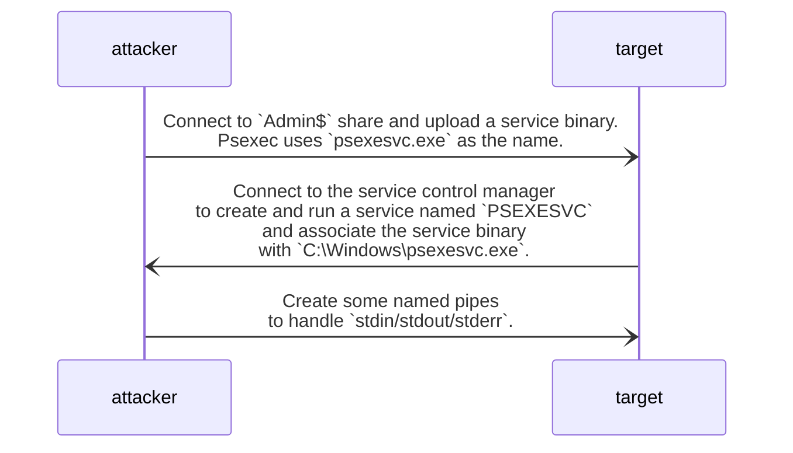

**Ports:** 445/TCP (SMB)
**Required Group Memberships:** Administrators
t’s intended to replace telnet-like applications and provide remote executionof processes on other systems through an interactive console.
https://learn.microsoft.com/en-us/sysinternals/downloads/psexec
It allows an administrator user to run commands remotely on any PC where he has access.


```powershell
cmd> ./PsExec64.exe -i  \\FILES04 -u <domain>\<username> -p <passwd> cmd
```