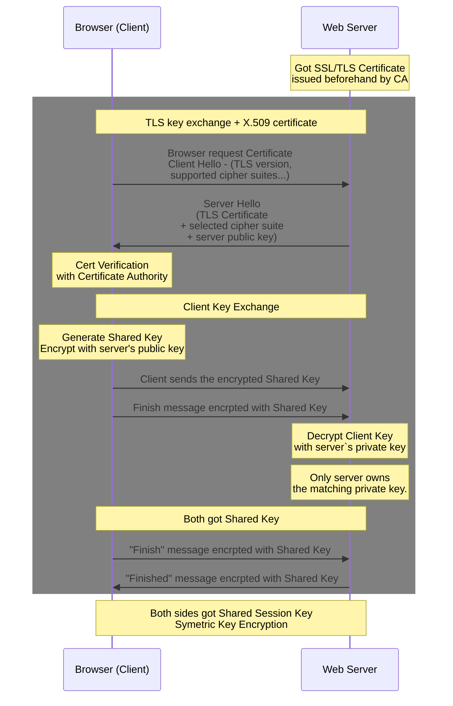

#TODO
Selfsigned Certificate https://www.youtube.com/watch?v=oplVr3Ha174&list=PLSNNzog5eyduzyJ8_6Je-tYOgMHvo344c&index=3
PKI - Third Party Trust - https://www.youtube.com/watch?v=LPxeYtMDxl0&list=PLSNNzog5eyduzyJ8_6Je-tYOgMHvo344c&index=4
https://www.youtube.com/watch?v=33VYnE7Bzpk

# TLS
