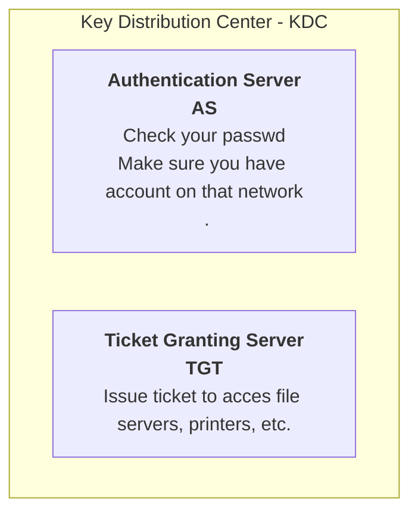
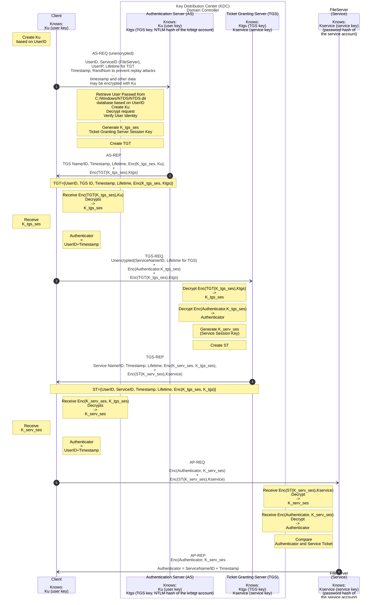

replaced NTLM
Kerberos (U:88, T:389)
Kerberos
U:88 - Kerberos services
T:389 - LDAP services

- **Kerberos Protocol**: Enables mutual authentication between clients and services.
- **Authentication Process**: Verifies users and services before session initiation.
- **Ticket System**: Utilizes shared key encryption for security. Users receive tickets granting access to network resources, and servers use these tickets to confirm user identity.
- **Domain Dependency**: All elements in a Kerberos transaction must be within the same domain, often Active Directory.

# Kerberos Authentication

## explained in details

**Kerberos principal** - a unique entity (a user or service) to which it can assign a ticket. A principal consists of the following components:
_USER_/_INSTANCE_@_REALM_

- primary: The first part of the principal. For users, this is usually the same as the user name.
- instance _(optional)_: Additional information characterizing the _primary_. This string is separated from the _primary_ by a `/`. `tux@example.org` and `tux/admin@example.org` can both exist on the same Kerberos system and are treated as different principals.
- realm: Specifies the Kerberos realm. Normally, your realm is your domain name in uppercase letters.

[Kerberos deep dive with message content and keys](https://www.youtube.com/watch?v=5N242XcKAsM)
[Sunny Classroom](https://www.youtube.com/watch?v=_44CHD3Vx-0&t=2s)
[Computerphile (YT) - Kerberos explained](https://www.youtube.com/watch?v=qW361k3-BtU)
[Network authentication with Kerberos - SUSE docs](https://documentation.suse.com/pl-pl/sles/15-SP5/html/SLES-all/cha-security-kerberos.html)

